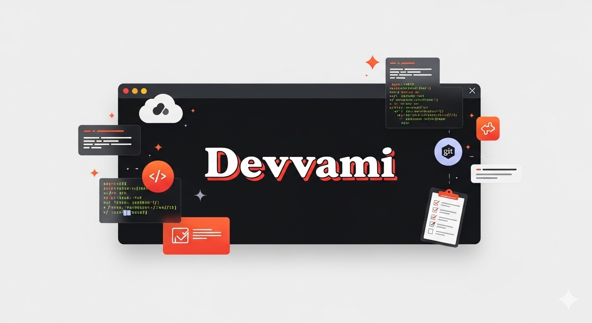

<p align="center">
  
</p>

# 🧰 Devvami

<p align="center">
  <strong>DevEx CLI for developers and teams — manage repos, PRs, pipelines, and costs from the terminal.</strong><br/>
  Built for teams that move fast.
</p>

<p align="center">
  <a href="https://www.npmjs.com/package/devvami"></a>
  <a href="https://github.com/savez/devvami/actions"></a>
  <a href="LICENSE"></a>
  <a href="https://node.green/#ESMM"></a>
</p>

---

## ✨ What It Does

Devvami gives you a unified CLI to manage your entire development workflow:

| Feature | What You Can Do |
|---|---|
| 🔀 **Pull Requests** | Create, review, and track PRs with presets |
| 🚀 **Pipelines** | Monitor CI/CD runs, view logs, rerun failures |
| 📁 **Repositories** | List and manage GitHub repos |
| 💸 **Costs** | Analyze AWS costs by service |
| ✅ **Tasks** | View and manage tasks without leaving the terminal |
| 📖 **Docs** | Search and read repository documentation |
| 🔍 **Search** | Search code across repositories |
| 🩺 **Health Check** | Diagnose your development environment |

All from your terminal. No context switching.

---

## 🚀 Quick Start

### Installation

```bash
npm install -g devvami
```

### First Time Setup

```bash
dvmi init
```

This wizard will:
- Check your development prerequisites
- Ask about GitHub organization (optional)
- Configure AWS profile and region
- Set up integrations (GitHub, AWS, task management)

### Verify Installation

```bash
dvmi --version
dvmi --help
dvmi doctor
```

---

## 📖 Commands

### Organization

```bash
dvmi init          # Setup: configure auth, org, AWS, integrations
dvmi doctor        # Health check: verify your environment
dvmi upgrade       # Update to latest version
dvmi whoami        # Show current identity (GitHub, AWS, etc.)
```

### Pull Requests

```bash
dvmi pr create     # Create a PR with presets
dvmi pr status     # Show PR status for current branch
dvmi pr detail     # View detailed PR information
dvmi pr review     # Review a PR
```

### Repositories

```bash
dvmi repo list     # List all repos in your org
dvmi create repo   # Create a new repo from template
```

### CI/CD Pipelines

```bash
dvmi pipeline status   # Show workflow status
dvmi pipeline logs     # View workflow logs
dvmi pipeline rerun    # Rerun a failed workflow
```

### Tasks & Work

```bash
dvmi tasks list       # List all tasks
dvmi tasks today      # Show today's tasks
dvmi tasks assigned   # Show tasks assigned to you
```

### Costs

```bash
dvmi costs get     # Analyze AWS costs
dvmi costs trend   # Show 2-month daily AWS cost trend
```

If `awsProfile` is configured (`dvmi init`), AWS cost commands automatically re-run via
`aws-vault exec <profile> -- ...` when credentials are missing, so developers can run:

```bash
dvmi costs get
dvmi costs trend
```

without manually prefixing `aws-vault exec`.

### Documentation

```bash
dvmi docs list       # List docs in repositories
dvmi docs read       # Read documentation
dvmi docs search     # Search docs
dvmi docs projects   # List documented projects
```

### Other

```bash
dvmi auth login      # Login to GitHub/AWS
dvmi search          # Search code across repos
dvmi changelog       # Generate changelog from commits
dvmi open            # Open resources in browser
```

---

## ⚙️ Configuration

Devvami stores config at `~/.config/dvmi/config.json`:

```json
{
  "org": "myorg",
  "awsProfile": "default",
  "awsRegion": "eu-west-1",
  "shell": "osxkeychain",
  "clickup": {
    "teamId": "...",
    "teamName": "My Team",
    "authMethod": "personal_token"
  }
}
```

Run `dvmi init` to update settings anytime.

---

## 🔐 Credentials

Devvami uses your system's **secure credential storage**:

- **macOS**: Keychain
- **Linux**: Secret Service / pass
- **WSL2**: Windows bridge for browser/GCM + Linux tooling for security setup
- **Windows (native / non-WSL)**: limited support (see Platform Support)

Tokens are **never stored in plain text**. They're stored securely via `@keytar/keytar`.

---

## 🖥️ Platform Support

### Fully supported

- **macOS**
- **Linux (Debian/Ubuntu family)**
- **Windows via WSL2**

### Linux/WSL notes

- `dvmi security setup` currently uses `apt-get` for package install (Debian/Ubuntu oriented).
- `dvmi security setup` requires authenticated `sudo` (`sudo -n true` must pass).
- On WSL2, browser opening tries `wslview` first, then falls back to `xdg-open`.

### Windows native (non-WSL)

- Not fully supported today.
- Platform detection does not handle `win32` explicitly yet.
- Some shell assumptions are Unix-centric (for example `which` usage and security setup steps).
- Recommended path on Windows is to use **WSL2**.

---

## 📚 Documentation

- **Setup**: See [Quick Start](#-quick-start) above
- **Commands**: Run `dvmi --help` or `dvmi <command> --help`
- **Contributing**: See [CONTRIBUTING.md](CONTRIBUTING.md)
- **Security**: See [SECURITY.md](SECURITY.md)
- **Code of Conduct**: See [CODE_OF_CONDUCT.md](CODE_OF_CONDUCT.md)

---

## 🤝 Contributing

We welcome contributions! See [CONTRIBUTING.md](CONTRIBUTING.md) for:

- **Development setup**
- **Code style** (JavaScript ESM + JSDoc)
- **Testing & linting**
- **Commit conventions**
- **PR process**

Quick start:

```bash
git clone https://github.com/savez/devvami
cd devvami
nvm use
pnpm install
pnpm test
pnpm lint
pnpm commit  # Use interactive commit
```

---

## 📋 Requirements

- **Node.js >= 24** (managed with [nvm](https://github.com/nvm-sh/nvm))
- **pnpm >= 10** or npm/yarn
- **Git**
- **GitHub CLI** (`gh`) — recommended
- **AWS CLI** — optional, for cost analysis

---

## 🐛 Found a Bug?

Please open an [issue](https://github.com/savez/devvami/issues/new?template=bug_report.md) with:

- Clear description of the problem
- Steps to reproduce
- Your environment (OS, Node.js version, etc.)
- Expected vs. actual behavior

For security issues, see [SECURITY.md](SECURITY.md).

---

## 💡 Have an Idea?

Open a [feature request](https://github.com/savez/devvami/issues/new?template=feature_request.md)

---

## 📄 License

MIT License — See [LICENSE](LICENSE) for details.

---

## 🙏 Credits

Built with:

- [oclif](https://oclif.io/) — CLI framework
- [octokit](https://github.com/octokit/rest.js) — GitHub API
- [chalk](https://github.com/chalk/chalk) — Colored output
- [ora](https://github.com/sindresorhus/ora) — Spinners
- [keytar](https://github.com/atom/node-keytar) — Secure credentials
- [@inquirer/prompts](https://github.com/SBoudrias/Inquirer.js) — Interactive prompts
- [execa](https://github.com/sindresorhus/execa) — Process execution
- [js-yaml](https://github.com/nodeca/js-yaml) — YAML parsing
- [marked](https://github.com/markedjs/marked) — Markdown parsing
- [figlet](https://github.com/patorjk/figlet.js) — ASCII art banners
- [open](https://github.com/sindresorhus/open) — Browser/app launcher
- [@aws-sdk](https://github.com/aws/aws-sdk-js-v3) — AWS services integration
- [pako](https://github.com/nodeca/pako) — Compression utilities

---

**Made with ❤️ by [Devvami Contributors](https://github.com/savez/devvami/graphs/contributors)**
